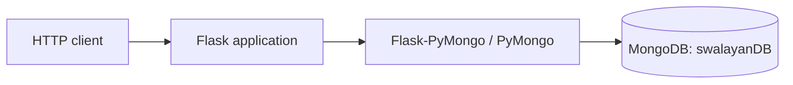

# Flask and MongoDB inventory API

[](https://www.python.org/)
[](https://flask.palletsprojects.com/)
[](https://www.mongodb.com/)

Academic cloud-computing lab implementing a small synchronous CRUD API with Flask and a local MongoDB database on a single virtual machine.

## What it implements

The service manages products in the `swalayanDB.produk` collection with three fields: `Nama_Produk`, `Harga`, and `Stok`.

| Method | Endpoint | Behavior |
| --- | --- | --- |
| `POST` | `/produk` | Create a product |
| `GET` | `/produk` | List all products |
| `PUT` | `/produk/<id>` | Update selected fields by MongoDB ObjectId |
| `DELETE` | `/produk/<id>` | Delete a product by MongoDB ObjectId |



The application binds to `0.0.0.0:5000`, which allows a VM firewall or security group to expose it when explicitly configured.

## Repository contents

```text
app.py              Flask routes and MongoDB access
requirements.txt    Python runtime dependencies
.gitignore          Python and local-environment exclusions
README.md           setup and API documentation
```

## Run locally

### Prerequisites

- Python 3
- MongoDB listening on `mongodb://localhost:27017`

### Setup

```bash
git clone https://github.com/RaihanHadriansyah21/Project-1-Cloud-Computing.git
cd Project-1-Cloud-Computing
python -m venv .venv
```

Activate the environment, then run:

```bash
python -m pip install -r requirements.txt
python app.py
```

Example request:

```bash
curl -X POST http://127.0.0.1:5000/produk \
  -H "Content-Type: application/json" \
  -d '{"Nama_Produk":"Beras","Harga":75000,"Stok":10}'
```

## Status and limitations

Course/lab project intended to demonstrate a basic single-VM Flask–MongoDB topology. It is not production-ready:

- MongoDB URI is fixed to localhost in `app.py`.
- Flask debug mode is enabled in the current entry point.
- There is no authentication, authorization, schema model, pagination, or automated test suite.
- Error responses may include exception detail.
- Deployment infrastructure is not included in the repository.

No license file is currently included.
